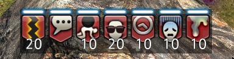
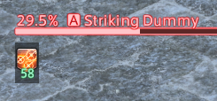

# Status Contrast

Status Contrast is a [Dalamud](https://github.com/goatcorp/Dalamud) plugin that
adds backgrounds to status effect icons in order to increase contrast and legibility

Examples:

## How To Install

StatusContrast is available on Dalamud. You can install from the plugin installer

## For developers

### Prerequisites

StatusContrast assumes all the following prerequisites are met:

* XIVLauncher, FINAL FANTASY XIV, and Dalamud have all been installed and the game
has been run with Dalamud at least once.
* XIVLauncher is installed to its default directories and configurations.
  * If a custom path is required for Dalamud's dev directory, it must be set with
  the `DALAMUD_HOME` environment variable.
* A .NET Core 9 SDK has been installed and configured, or is otherwise available.
(In most cases, the IDE will take care of this.)

### Building

1. Open up `StatusContrast.sln` in your C# editor of choice (likely
[Visual Studio 2022](https://visualstudio.microsoft.com) or
[JetBrains Rider](https://www.jetbrains.com/rider/)).
2. Build the solution. By default, this will build a `Debug` build, but you can
switch to `Release` in your IDE.
3. The resulting plugin can be found at
`StatusContrast/bin/x64/Debug/StatusContrast.dll` (or `Release` if appropriate.)

### Activating in-game

1. Launch the game and use `/xlsettings` in chat or `xlsettings` in the Dalamud
Console to open up the Dalamud settings.
    * In here, go to `Experimental`, and add the full path to the
    `StatusContrast.dll` to the list of Dev Plugin Locations.
2. Next, use `/xlplugins` (chat) or `xlplugins` (console) to open up the Plugin Installer.
    * In here, go to `Dev Tools > Installed Dev Plugins`, and the `Status Contrast`
    should be visible. Enable it.
3. You should now be able to use `/et` (chat) or `et` (console)!

Note that you only need to add it to the Dev Plugin Locations once (Step 1); it
is preserved afterward. You can disable, enable, or load your plugin on startup
through the Plugin Installer.
